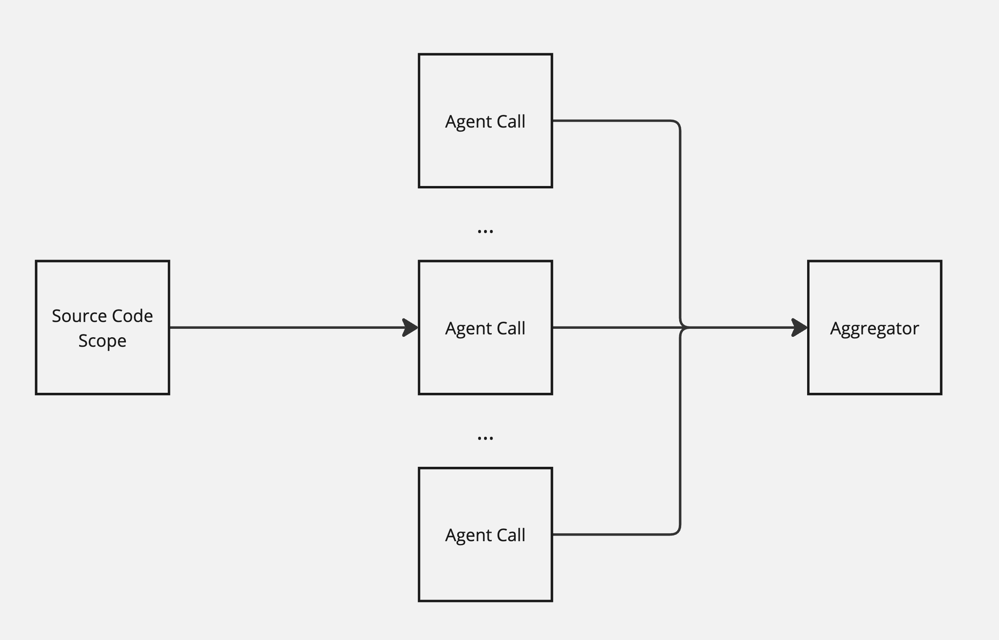
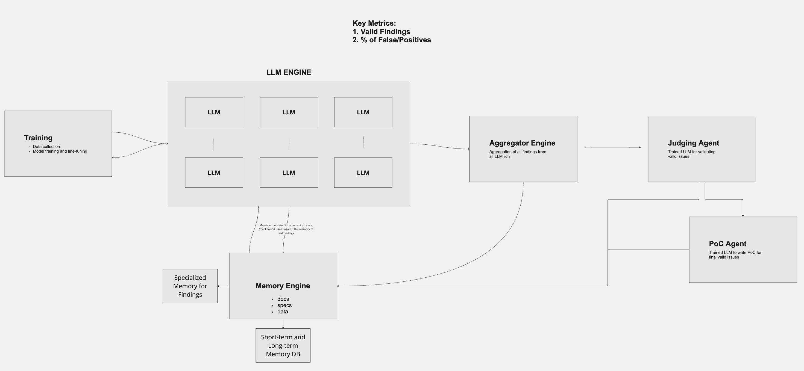

# koban-research

Smart AI agent that can detect vulnerabilities in your solidity codebase.

## We've already solved

To check the correctness of the found vulnerabilities, we use the `backtracking` mechanism. It allows us to compare previous findings(from real contests by real people) with what our agent produces.

- [damn-vulnerable-defi](./reports/damn-vulnerable-defi/)
- [eco protocol](./reports/eco-protocol/)
- [gamma-staking](./reports/gamma-staking/)

## Architecture

For the demonstration, we use a simple `[Agents..] -> Aggregator` architecture. We generate N queries to different LLMs, analyze the responses and aggregate them through an additional call to the `Aggregator` or `Synthesizer`, it identifies the most likely vulnerabilities.

With good prompt optimization, `o1-preview` model is able to identify vulnerabilities in real-world [contests](./reports/eco-protocol/) and production.

## Future Architecture

Our main goals are to increase the percentage of valid vulnerabilities and decrease the percentage of false-positive vulnerabilities.

Such an architecture can seriously improve the results due to PoC generation and overall scaling. The key element is an agent that can write tests and interact with the environment. This will significantly improve metrics.

## Basic limitations

- Currently we limited by LLM's context window. Biggest models support up to 128000 tokens ±3000 nSLOC. But this could be potentially solved by analyzing different parts of AST.
- We can't create a PoC because at the moment it complicates the architecture too much and is beyond the scope of the demo, however we plan to make it a priority.

## Note

This project at early concept stage. Everything in this repo is subject to change. Nothing is optimized or adjusted to production quality. Just PoC.
