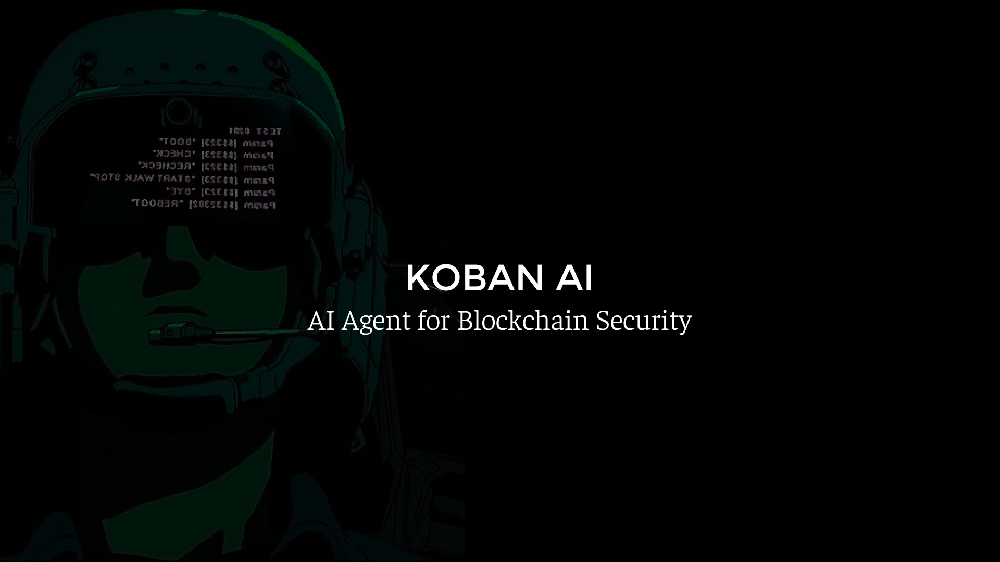

# koban-research

Smart AI agent that can detect vulnerabilities in your solidity codebase.



## We've already solved

To check the correctness of the found vulnerabilities, we use the `backtracking` mechanism. It allows us to compare previous findings(from real contests by real people) with what our agent produces.

- damn-vulnerable-defi
    - [Audit](./reports/damn-vulnerable-defi/)
- eco-protocol
    - [Audit](./reports/eco-protocol/)
    - [Contest](https://audits.sherlock.xyz/contests/80?filter=questions)
- gamma-staking
    - [Audit](./reports/gamma-staking/)
    - [Contest](https://audits.sherlock.xyz/contests/330?filter=questions)
- truflation
    - [Audit](./reports/truflation/)
    - [Contest](https://audits.sherlock.xyz/contests/151?filter=questions)
- hats-protocol
    - [Audit](./reports/hats-protocol/)
    - [Contest](https://audits.sherlock.xyz/contests/614?filter=questions)
- coinbase-smart-wallet
    - [Audit](./reports/coinbase-smart-wallet/)
    - [Contest](https://code4rena.com/audits/2024-03-smart-wallet)

## Architecture

For the demonstration, we use a simple `[Agents..] -> Aggregator` architecture. We generate N queries to different LLMs, analyze the responses and aggregate them through an additional call to the `Aggregator` or `Synthesizer`, it identifies the most likely vulnerabilities.

With good prompt optimization, `o1-preview` model is able to identify vulnerabilities in real-world [contests](./reports/eco-protocol/) and production.


## Future Architecture

Our main goals are to increase the percentage of valid vulnerabilities and decrease the percentage of false-positive vulnerabilities.

Such an architecture can seriously improve the results due to PoC generation and overall scaling. The key element is an agent that can write tests and interact with the environment. This will significantly improve metrics.


## Basic limitations

- Currently we limited by LLM's context window. Biggest models support up to 128000 tokens ±3000 nSLOC. But this could be potentially solved by analyzing different parts of AST.
- We can't create a PoC because at the moment it complicates the architecture too much and is beyond the scope of the demo, however we plan to make it a priority.

## How to run this?

You need an openai account with balance and access to the latest o1 model.

1. Clone repo and go to directory:
    ```sh
    git clone https://github.com/koban-ai/koban-research.git
    cd koban-research
    ```
2. Obtain OpenAI API key, create `.env` file and paste your key:
    ```dosini
    OPENAI_API_KEY=paste-your-key-here
    ```
3. Create missing directories:
    ```sh
    mkdir audit-code
    mkdir reports
    ```
4. Install project dependencies(we recomend using [Bun](https://bun.sh/docs/installation)):
    ```sh
    bun install
    # or(if you're using node.js): npm install
    ```
5. Clone sample project from contest into `audit-code` directory:
    ```sh
    cd audit-code
    git clone https://github.com/sherlock-audit/2023-05-ecoprotocol.git
    cd ..
    ```
6. Paste code into `src/main.ts` and run!:

    ```typescript
    import OpenAI from "openai";
    import { LLMAnalyzer } from "../llm-analyzer";
    import { FileScopeExtractor } from "../scope-extractor";
    import { VectorDbProcessor } from "../vector-db-processor";
    import dedent from "dedent";

    const openai = new OpenAI();

    const main = async () => {
        // Define protocol scope
        const ecoProtocolScopeFiles = [
            // Token
            "audit-code/2023-05-ecoprotocol/op-eco/contracts/token/TokenInitial.sol",
            "audit-code/2023-05-ecoprotocol/op-eco/contracts/token/L2ECO.sol",
            "audit-code/2023-05-ecoprotocol/op-eco/contracts/token/ERC20Upgradeable.sol",

            // Bridge
            "audit-code/2023-05-ecoprotocol/op-eco/contracts/bridge/CrossDomainEnabledUpgradeable.sol",
            "audit-code/2023-05-ecoprotocol/op-eco/contracts/bridge/InitialBridge.sol",
            "audit-code/2023-05-ecoprotocol/op-eco/contracts/bridge/L1ECOBridge.sol",
            "audit-code/2023-05-ecoprotocol/op-eco/contracts/bridge/L2ECOBridge.sol",
        ];

        // Load code scope
        const ecoScopeResult = await FileScopeExtractor.load(
            ecoProtocolScopeFiles
        );
        if (!ecoScopeResult.success) {
            console.error("Can't load scope");
            return;
        }
        const ecoScope = ecoScopeResult.return;

        const vectorDb = new VectorDbProcessor(openai);
        const llmAnalyzer = new LLMAnalyzer(openai, vectorDb);

        // Start scope analysis with 100 iterations.
        await llmAnalyzer.analv1Backtrack(
            ecoScope,
            "eco",
            dedent`
                # Malicious actor cause rebase to an old inflation multiplier
    
                ## Summary:
                The protocol has a rebasing mechanism that allows to sync the inflation multiplier between both L1 and L2 chains.
                The call to rebase is permissionless (anyone can trigger it).
                Insufficant checks allow a malicious actor to rebase to an old value.
    
                ## Vulnerability Detail:
                Rebasing from L1 to L2 is through the L1ECOBridge rebase function. It collects the inflation multiplier from the ECO token and sends a message to L2ECOBridge to update the L2 ECO token inflation multiplier.
                \`\`\`solidity
                function rebase(uint32 _l2Gas) external {
                    inflationMultiplier = IECO(l1Eco).getPastLinearInflation(
                        block.number
                    );
    
                    bytes memory message = abi.encodeWithSelector(
                        IL2ECOBridge.rebase.selector,
                        inflationMultiplier
                    );
    
                    sendCrossDomainMessage(l2TokenBridge, _l2Gas, message);
                }
                \`\`\`
                A malicious actor can call this function a large amount of times to queue messages on L2CrossDomainMessenger.
                Since it is expensive to execute so much messages from L2CrossDomainMessenger (especially if the malicious actor sets _l2Gas to a high value) there will be a rebase message that will not be relayed through L2CrossDomainMessenger (or in failedMessages array).
    
                Some time passes and other legitimate rebase transactions get executed.
    
                One day the malicious actor can execute one of his old rebase messages and set the value to the old value. The attacker will debalance the scales between L1 and L2 and can profit from it.
    
                ## Impact:
                Debalance the scales between L1 and L2 ECO token.
    
                ## Recommendation:
                When sending a rebase from L1, include in the message the L1 block number. In L2 rebase, validate that the new rebase block number is above previous block number.
            `,
            100,
            ["o1-preview", "chatgpt-4o-latest"],
            undefined,
            dedent`
                Eco enables any onchain action to be a simple, one-click stablesend. With Eco, apps can easily accept anyone’s preferred stablecoin, regardless of the network — unlocking stablecoin liquidity from any connected chain and giving users the simplest onchain experience. To make this possible, the Eco Protocol brings together Routes, Accounts, and Crowd Liquidity (coming soon) to give app developers the ultimate flexibility while prioritizing speed, cost, and security.
    
                To make transaction costs negligible, minimize the number of necessary user actions, and avoid introducing centralized dependencies, Eco focuses on a singular, opinionated use case: fast, cheap, single-click stablecoin transaction execution anywhere across Ethereum (and eventually beyond). Eco is designed on the premise that stablecoins are the most intuitive and interoperable asset to bring users onchain. Eco makes it as fast and easy as possible for onchain app developers to attract stablecoin liquidity, price onchain actions in everyday currencies, and enable one-click sends to any supported chain or application.
    
                Eco Routes provide developers with secure and cheap token transfer pathways between any other rollup settling on Ethereum (L2 or L3), with a network of fillers providing on-demand liquidity. Eco Accounts provides developers with a seamless way to manage cross-chain accounts with chain-abstracted balances, making it easy to support cross-chain interactions. The Eco Network will eventually aggregate liquidity to make it easy for app developers to provide users with more intuitive and cost-minimized onchain experiences denominated in stablecoins.
            `
        );
    };

    main().catch(console.error);
    ```

    Run:

    ```sh
    bun dev
    ```

    Results will appear in `reports/` folder.

## Note

This project at early concept stage. Everything in this repo is subject to change. Nothing is optimized or adjusted to production quality. Just PoC.
